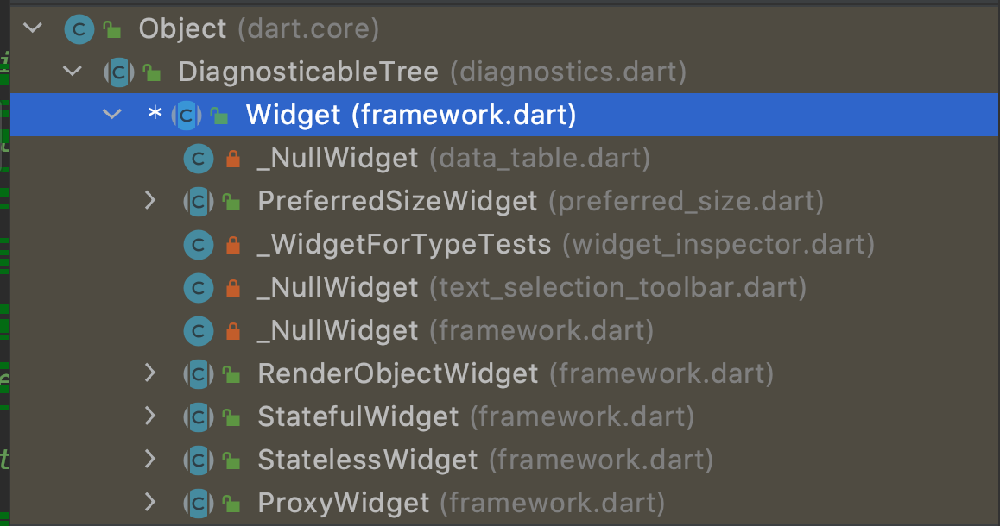
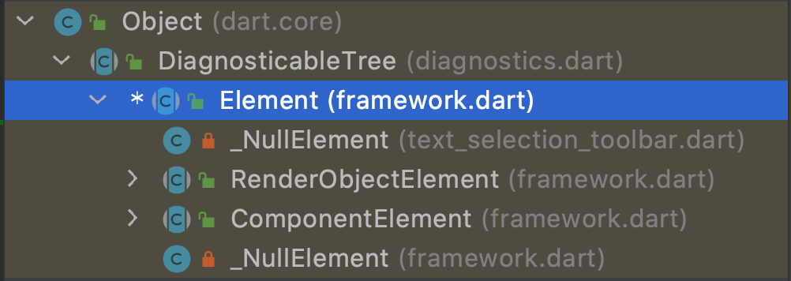
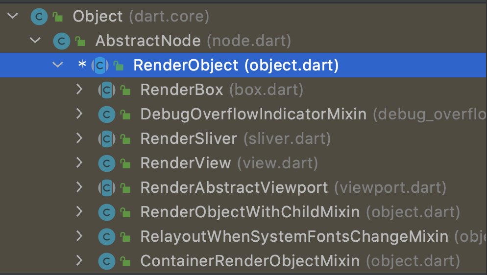
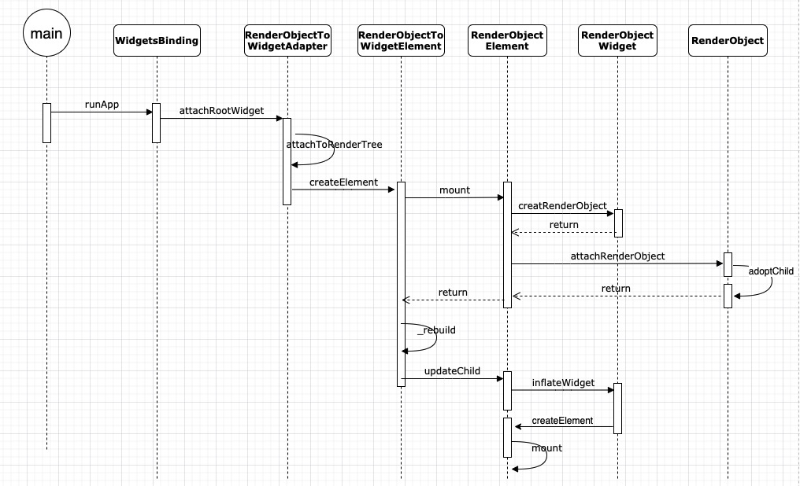

# Flutter中三棵树的理解

## 哪三棵

### Widget

Widget 是用户页面的描述，表示了Element的配置信息，Flutter页面都是由各种个样的Widget组合声明成的。Widget本身是不可变的immutable，注解如下：

```dart
@immutable
abstract class Widget extends DiagnosticableTree {}
```

这也就意味着，所有它直接声明或继承的变量都必须为final类型的。如果想给widget关联一个可变的状态，考虑使用StatefulWidget，它会通过[StatefulWidget.createState]创建一个State对象，然后，每当它转化成一个element时会合并到树上。

子类：



StatelessWidget、StatefulWidget我们很熟悉是用来编写页面和组件的，那另外三个都是做什么用的呢？

* RenderObjectWidget，从名字上就能看出它是一个Widget，然后和实际渲染对象RenderObject有撇不清的关系。它提供了RenderObjectElement的配置信息，其中包装了RenderObject。也就是从页面上编写的StatelessWidget和StatefulWidget在递归的build过程中，会最终返回实际可渲染的Widget对象，也就是RenderObjectWidget，那么这个转化关系是一一对应的吗，其实不是的，后边再具体分析
* PreferredSizeWidget，一个返回它自身想要大小的组件，如果它在布局过程中是不受限制的，例如，AppBar和TabBar
* ProxyWidget，代理组件，提供一个子组件，而不是自己创建，例如，InheritedWidget和ParentDataWidget


### Element

元素树，是Widget在具体位置的实例化，它负责控制Widget的生命周期，持有了widget实例和renderObject实例，它和Widget继承自同一个类，DiagnosticableTree可诊断树，并且实现了BuildContext类。



### RenderObject

渲染树中的每个节点基类是RenderObject，它定义了布局和绘制的抽象模型。每一个RenderObjects又一个parent，和一个插槽parentData，父级的RenderObject可以在其中存储孩子的具体数据，例如，child的位置信息。



* RenderObject 仅实现了基本的布局和绘制，没有具体的布局绘制模型，相当于ViewGroup，其子类RenderBox使用了笛卡尔坐标系，它的一些子类是真正的渲染树上的节点。大多数情况下，当我们想自定义一个渲染对象时，直接继承RenderObject有些过重，更好的选择是继承RenderBox，除非你不想使用笛卡尔坐标系统。
* RenderView，通常情况下是Flutter渲染树的根节点，可以理解为DecorView，它只有一个子节点，必须是RenderBox类型的。

## 对应关系

### 从Widget构建Element

看这段简单的代码片段，显示了widget树形结构

```dart
Container(
  color: Colors.blue,
  child: Row(
    children: [
      Image.network('https://www.example.com/1.png'),
      const Text('A'),
    ],
  ),
);
```

当Flutter要渲染这个Container到页面时，会调用它的build()方法，返回一个widget的子树，包含它的child树Row及其children的子树，还有一些其它的树的节点，看下它的build()函数：

```dart
class Container extends StatelessWidget {
  ///  创建一个结合常用的绘画、定位和控制大小的组件
	Container({
    Key? key,
    this.alignment,
    this.padding,
    this.color,
    this.decoration,
    this.foregroundDecoration,
    double? width,
    double? height,
    BoxConstraints? constraints,
    this.margin,
    this.transform,
    this.transformAlignment,
    this.child,
    this.clipBehavior = Clip.none,
  }) : // ...
  
  @override
  Widget build(BuildContext context) {
    Widget? current = child;
		// ...
    if (alignment != null)
      current = Align(alignment: alignment!, child: current);

    // ...
    if (effectivePadding != null)
      current = Padding(padding: effectivePadding, child: current);

    if (color != null)
      current = ColoredBox(color: color!, child: current);
		// ...
    if (decoration != null)
      current = DecoratedBox(decoration: decoration!, child: current);

    return current!;
  }
}
```

可以看到，Container一个属性，都代表插入一个控制该属性的新节点widget，它本身就是一个封装，替我们组合了大量小部件，减轻了开发工作量。我们设置了color熟悉，所以它会插入一个ColoredBox节点，显示它的颜色

相应的，Image和Text在build期间也可能插入子节点比如RawImage和RichText，所以widget树的层级结构可能比代码展示的更深


在构建阶段，Flutter将上述的widget转换成相应的**element tree** ，一一对应，树的层级结构上的每个元素代表了一个具体位置的widget实例。

> 这里的一一对应其实是framework层的经过转化后的widget，并不是代码层的用户编写的widget跟element的对应，比如一个Container在设置属性后被转化成多个子widget，同时对应了多个element节点。


Element有两种基本类型：

* ComponentElement，其他elements的宿主，它本身不包含RenderObject，而由它持有的element节点包含，像StatelessWidget 和StatefulWidget 中分别创建的StatelessElement和StatefulElement都是继承自ComponentElement
* RenderObjectElement，参与layout或者绘制阶段的元素

上边提到了Element实现了BuildContext，任何widget的element可以通过build()方法中传入的BuildContext参数访问到，它是widget在树上操作的句柄。例如，可以调用Theme.of(context)，查找widget树上最近的主题，如果widget定义了单独的主题就返回它，如果没有返回app的主题

```dart
/// An [Element] that uses a [StatelessWidget] as its configuration.
class StatelessElement extends ComponentElement {
  /// Creates an element that uses the given widget as its configuration.
  StatelessElement(StatelessWidget widget) : super(widget);

  @override
  StatelessWidget get widget => super.widget as StatelessWidget;

  @override
  Widget build() => widget.build(this);

  @override
  void update(StatelessWidget newWidget) {
    super.update(newWidget);
    assert(widget == newWidget);
    _dirty = true;
    rebuild();
  }
}
```

可以看到，StatelessElement元素在构建的时候调用build方法，会调用StatelessWidget的build方法，传入BuildContext为this。

因为widgets是immutable的，包括节点之间的父/子关系，对widget树的任何修改（比如，Text('A') to Text('B'))会导致一系列新的widget对象的被返回。但这并不意味下层必须被重建，element tree可能在界面刷新时是持久的（persistent），因此对性能起着关键作用，因为Flutter缓存了底层表示，使它表现的可以像完全丢弃上层的widget层一样。通过遍历widgets的修改，可以做到只重新构建一部分的element tree。

### Element到RenderObject

只绘制单个的widget的应用是很少见的，所以，任何的UI框架的一个重要的部分就是能够高效的布局一个层级结构的widget，确定它们的大小、位置然后绘制到屏幕上。

渲染树上的每个节点的基类型是RenderObject，在构建阶段，Flutter仅将element tree中的RenderObjectElement对象成可渲染的对象，不同的Render对象渲染不同类型，[`RenderParagraph`](https://api.flutter.dev/flutter/rendering/RenderParagraph-class.html)渲染text，[`RenderImage`](https://api.flutter.dev/flutter/rendering/RenderImage-class.html) 渲染image


Flutter中多数widgets的渲染对象是继承自RenderBox的，它使用了笛卡尔坐标系在2D空间，它提供了一个盒子约束模型，限制了widget的最小和最大宽度和高度。

layout期间，Flutter会以深度优先遍历渲染树，并将constraints约束传递给child，用来确定child的大小，然后将结果传递给parent的size变量。

```dart
/// 子类不应该直接重写[layout]方法，而应该重写[performResize] and/or [performLayout]， [layout]方法
/// 代理它的工作放在 [performResize] and [performLayout]
/// parent's的[performLayout]方法应该无条件的调用所有它的child的[layout]
void layout(Constraints constraints, { bool parentUsesSize = false }) {
   /// ...
    try {
      performLayout();
      markNeedsSemanticsUpdate();
      
    } catch (e, stack) {
      _debugReportException('performLayout', e, stack);
    }
    /// ...
    _needsLayout = false;
    markNeedsPaint();
 }

/// 空实现，由子类重写
  @protected
 	void performLayout();
```

举例，看下RenderPadding的performLayout方法：

```dart
@override
  void performLayout() {
    /// 第一步，拿到constraints
    final BoxConstraints constraints = this.constraints;
    // ...
    /// 第二步，根据parent的constraints，计算自己内部的constraints
    final BoxConstraints innerConstraints = constraints.deflate(_resolvedPadding!);
    /// 第三步，继续向下遍历layout
    child!.layout(innerConstraints, parentUsesSize: true);
    final BoxParentData childParentData = child!.parentData! as BoxParentData;
    childParentData.offset = Offset(_resolvedPadding!.left, _resolvedPadding!.top);
    /// 第四步，根据constraints生成size
    size = constraints.constrain(Size(
      _resolvedPadding!.left + child!.size.width + _resolvedPadding!.right,
      _resolvedPadding!.top + child!.size.height + _resolvedPadding!.bottom,
    ));
  }
```

这样就完成了树的深度遍历过程


盒子约束模型是一种很强大的布局对象的方式，时间复杂度为O(n)

所有RenderObjects的根节点是RenderView，它代表了整个渲染树的输出。当平台需要渲染新的帧时（例如，一个vsync信号触发，或者texture的解压/上传完成）会调用RenderView对象中的compositeFrame()方法，它创建了一个SceneBuilder触发屏幕的更新。当更新完成时，RenderView会传递这个压缩的scene到dart:ui包中的Window.render()方法，该方法控制GPU将它渲染。

### 是一一对应的关系吗

从上面图中可以轻松看出，并不是。

<table>
	<thead>
  	<tr>
            <th width=100>类型</th>
            <th>Widget</th>
            <th>Element</th>
      			<th>RenderObject</th>
      			<th>说明</th>
        </tr>
  </thead>
  <tbody>
        <tr>
            <td rowspan=2>组合型</td>
            <td>StatelessWidget</td>
            <td rowspan=3>ComponentElement</td>
          	<td>NA</td>
          <td rowspan=2>组合节点，不对应RenderObject</td>
        </tr>
        <tr>
            <td>StatefulWidget</td>
          	<td>NA</td>
        </tr>
        <tr>
            <td>代理型</td>
            <td>ProxyWidget</td>
          	<td>NA</td>
          	<td>代理组件，数据传递</td>
        </tr>
        <tr>
            <td rowspan=4>展示型</td>
          	<td>RenderObjectWidget</td>
          	<td>RenderObjectElement</td>
          	<td>RenderObject</td>
          	<td>实际渲染对象</td>
    		</tr>
  </tbody>
</table>

> 表中仅列出了常用Widget和对应关系，并不代表全部

所以说widget和element和renderObject是一一对应是有语境的，在展示型这一行的情况下是没问题的，但是在全局范围这么说，是absolutly not的。还有从后往前说，一个RenderObject对应一个Element和一个Widget是没问题的，但是，正着说也是不准确的。


## 串联过程

上面粗略的看了三颗树的转化过程，那么在代码层面，他们是如何经过方法的调用串联起来的呢？可以主要分为两个过程：

### 根view的attachRootWidget

初始化Widget树Element树和RenderObject树的root节点，分别是RenderObjectToWidgetAdapter、RenderObjectToWidgetElement、RenderView。

然后在WidgetsBinding.attachRootWidget方法中，将runApp传入的rootWidget添加到widget树根RenderObjectToWidgetAdapter实例的child上，调用它的attachToRenderTree，将element关联到RenderTree上，调用了element的mount方法。

```dart
/// Takes a widget and attaches it to the [renderViewElement], creating it if
  /// necessary.
  /// This is called by [runApp] to configure the widget tree.
  ///  * [RenderObjectToWidgetAdapter.attachToRenderTree], which inflates a
  ///    widget and attaches it to the render tree.
  void attachRootWidget(Widget rootWidget) {
    final bool isBootstrapFrame = renderViewElement == null;
    _readyToProduceFrames = true;
    _renderViewElement = RenderObjectToWidgetAdapter<RenderBox>(
      container: renderView,
      debugShortDescription: '[root]',
      child: rootWidget,
    ).attachToRenderTree(buildOwner!, renderViewElement as RenderObjectToWidgetElement<RenderBox>?);
    if (isBootstrapFrame) {
      SchedulerBinding.instance!.ensureVisualUpdate();
    }
  }
```

其中的renderView就是RenderObject tree上的根节点，它是在RendererBinding类中被初始化的

```dart
/// The glue between the render tree and the Flutter engine.
/// render tree 和 Flutter engine之间的胶水
mixin RendererBinding on BindingBase, ServicesBinding, SchedulerBinding, GestureBinding, SemanticsBinding, HitTestable {
	 @override
  void initInstances() {
    super.initInstances();
    /// ...
    initRenderView();
   /// ...
  }
  
  void initRenderView() {
		/// ...
    renderView = RenderView(configuration: createViewConfiguration(), window: window);
    renderView.prepareInitialFrame();
  }

}
```

attachToRenderTree方法

```dart
/// Used by [runApp] to bootstrap applications.
/// 供runApp使用来引导程序
class RenderObjectToWidgetAdapter<T extends RenderObject> extends RenderObjectWidget {
	/// Used by [runApp] to bootstrap applications.
  RenderObjectToWidgetElement<T> attachToRenderTree(BuildOwner owner, [ 	         RenderObjectToWidgetElement<T>? element ]) {
    if (element == null) {
      owner.lockState(() {
        element = createElement();
        assert(element != null);
        element!.assignOwner(owner);
      });
      owner.buildScope(element!, () {
        element!.mount(null, null);
      });
    } else {
      element._newWidget = this;
      element.markNeedsBuild();
    }
    return element!;
  }

	RenderObjectToWidgetElement<T> createElement() => RenderObjectToWidgetElement<T>(this);

}
```

这里element为空，所以创建了RenderObjectToWidgetElement的实例，然后mount。

### 子view的attachToRenderTree

element的mount方法中，这里触发了挂载element到Element tree，判断是包含渲染对象的RenderObjectElement就创建RenderObject，调用attachRenderObject挂载到RenderObject tree上。然后_rebuild→updateChild→inflateWidget→newChild.mount(this, newSlot)触发了树的深度遍历



## 有什么作用

## 开发中注意什么

## 总结

